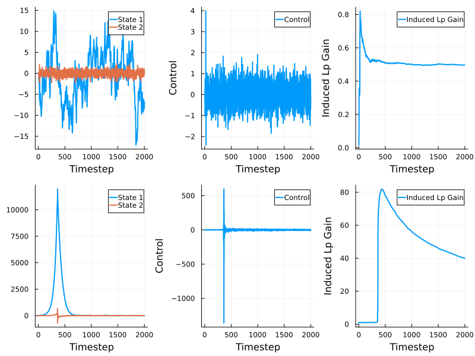
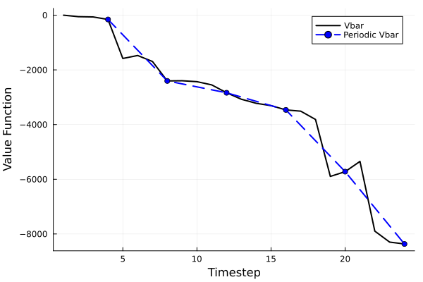

# Output feedback with approximate pole cancellation
This example compares the minimax adaptive controller to the self-tuning LQG controller.
## Introduction
The minimum phase system, ``G_\text{mp}``, and the nonminimum-phase system, ``G_\text{nmp}``, have state-space realizations ``(A, B, C_\text{mp}, D, G)`` and ``(A, B, C_\text{nmp}, D, G)`` respectively, where
```math
	\begin{aligned}
		A & = \begin{bmatrix}1 & 1\\ 0 & 1\end{bmatrix}, & B & = \begin{bmatrix}0 \\ 1\end{bmatrix}, \\
		C_\text{mp} & = \begin{bmatrix}-1/z_0 + z_0 \\ z_0\end{bmatrix}^\top, & C_\text{nmp} & = \begin{bmatrix}-z_0 + 1/z_0 \\ 1/z_0\end{bmatrix}^\top.
	\end{aligned}
```
Here ``z_0 = 1.01``, ``G = I / 100`` and ``D = 1/10``.
The goal is to synthesize a controller ``\mu`` that, for as small a ``\gamma > 0`` as possible, minimizes
```math
\sup_{C, w, v, N} \sum_{t = 0}^N \left(|x_t|^2_Q + |u_t|^2_R - \gamma^2 |(w_t, v_t)|^2 \right),
```
where ``Q = I`` and ``R = I/100``.

## Preliminaries
Load the packages
```julia
using MinimaxAdaptiveControl
using LinearAlgebra, Random
using JuMP 
using Clarabel 
```
and define the `optimizer_factory` to be used throughout
```julia
optimizer_factory = () -> Clarabel.Optimizer
```

## Controller synthesis
### Minimax Adaptive Controller

We first define the nominal models
```julia
a = 1.01
A = [1.0 1.0; 0.0 1.0]
B1 = [0.0 1.0]'
B2 = [0.0 1.0]'
C1 = [-a + 1/a 1/a]
C2 = [-1/a + a a]
D = fill(1.0,1,1) / 10
G = [1.0 0; 0 1.0] / 100
Q = [1.0 0; 0 1.0] / 100
R = fill(1.0,1,1) / 100
γ = 20.0
sys1 = OFLinMod(A, B1, G, C1, D, Q, R)
sys2 = OFLinMod(A, B2, G, C2, D, Q, R)
sys = [sys1, sys2]
```
We next reduce the system to principal form using [reduceSys](@ref)
```julia
models = [Model(optimizer_factory()), Model(optimizer_factory())]
(A, B, G, Ks, Hs) = reduceSys(sys, γ, models)
```
and check the termination statuses as a first test that ``\gamma`` is not too small.
```
julia> termination_status.(models)
2-element Vector{MathOptInterface.TerminationStatusCode}:
 OPTIMAL::TerminationStatusCode = 1
 OPTIMAL::TerminationStatusCode = 1
```

Next, we solve the periodic bellman inequalities with a period ``\tau = 4``
```julia
model = Model(optimizer_factory())
set_silent(model)
period = 4
Ps0, Psplus= MACLMIs(A, B, G, Ks, Hs, period, model)
```
and verify that ``\gamma`` is a valid upper bound
```
julia> termination_status(model)
OPTIMAL::TerminationStatusCode = 1
```

Next we synthesize the selection rule using [getPeriodicSelectionRule](@ref) and the controller using [MAController](@ref)
```julia
N = length(Hs) # = 2
selectionRule = getPeriodicSelectionRule(period)
mac = MAController(zeros(4), A, B, G, Ks, Hs, zeros(N), selectionRule)
```

### Self-tuning regulator: certainty equivalence LQG
We will construct a [SelfTuningLQG](@ref) object with randomized initial estimates:
```julia
A0 = randn(2, 2)
B0 = randn(2, 1)
C0 = randn(1, 2)
K0 = randn(2, 1)
S0 = Matrix{Float64}(I(2))
L0 = zeros(1, 2)
Q0 = Matrix{Float64}(I(2))
ρ0 = 1.0
xhat0 = randn(2)
nu = 2
str = SelfTuningLQG(A0, K0, C0, B0, xhat0, 0.0, 1.0, nu)
```

## Simulation
We will simulate for
```julia
Tdur = 2000
```
steps.
We define two equivalent simulation models as [OFPlant](@ref) objects:
```julia
Asim = [1.0 1.0; 0.0 1.0]
Bsim = [0.0 1.0]'
Csim = [-a + 1/a 1/a]
Dsim = fill(1.0,1,1) / 10
Gsim = [1.0 0; 0 1.0] / 100
Qsim = [1.0 0; 0 1.0] / 100
Rsim = fill(1.0,1,1) / 100
plantMAC= OFPlant(Asim, Bsim, Gsim, Csim, Dsim, zeros(2))
plantSTR = OFPlant(Asim, Bsim, Gsim, Csim, Dsim, zeros(2))
```

Both simulations will be affected by the same process and measurement noise
```julia
processDisturbances = randn(Tdur, 2)
measurementDisturbances = randn(Tdur, 1)
```

Next we construct matrices to store the state, input, output and metric trajectories
```julia
statesMAC = zeros(Tdur + 1, 2)
statesSTR = zeros(Tdur + 1, 2)
outputsMAC = zeros(Tdur + 1, 1)
outputsSTR = zeros(Tdur + 1, 1)
controlsMAC = zeros(Tdur, 1)
controlsSTR = zeros(Tdur, 1)
vfunMAC = getValueFunction(mac, Ps0, N)
dcMAC = InducedlpGain(0.0, 0.0, 0.0, 2)
dcSTR = InducedlpGain(0.0, 0.0, 0.0, 2)
metricsMAC = [vfunMAC, dcMAC]
metricsSTR = [dcSTR]
metricResultsMAC = zeros(Tdur + 1, length(metricsMAC))
metricResultsSTR = zeros(Tdur + 1, length(metricsSTR))
```

Finally we run the simulations
```julia
simulate!(statesMAC, outputsMAC, controlsMAC, processDisturbances, measurementDisturbances, metricResultsMAC, metricsMAC, plantMAC, mac, Tdur)
simulate!(statesSTR, outputsSTR, controlsSTR, processDisturbances, measurementDisturbances, metricResultsSTR, metricsSTR, plantSTR, str, Tdur)
```
and plot the results
```julia
plt = plot(layout = (2, 3), size = (800, 600))
plot!(plt[1], statesMAC, xlabel = "Timestep", label = ["State 1" "State 2"], linewidth = 2, legend = :topright)
plot!(plt[2], controlsMAC, xlabel = "Timestep", ylabel = "Control", label = "Control", linewidth = 2)
plot!(plt[3], metricResultsMAC[1:end-1, 2], xlabel = "Timestep", ylabel = "Induced Lp Gain", label = "Induced Lp Gain", linewidth = 2)
plot!(plt[4], statesSTR, xlabel = "Timestep", label = ["State 1" "State 2"], linewidth = 2)
plot!(plt[5], controlsSTR, xlabel = "Timestep", ylabel = "Control", label = "Control", linewidth = 2)
plot!(plt[6], metricResultsSTR[1:end-1, 1], xlabel = "Timestep", ylabel = "Induced Lp Gain", label = "Induced Lp Gain", linewidth = 2)
```


We also plot the valubound and highlight that it's periodically nonincreasing
```julia

plot(1:numPeriods*period, metricResultsMAC[1:numPeriods*period, 1], linestyle = :solid, linewidth = 2, color = :black, label = "Vbar")
plot!(inds[1:numPeriods], metricResultsMAC[inds[1:numPeriods], 1], xlabel = "Timestep", ylabel = "Value Function", label = "Periodic Vbar", linewidth = 2, linestyle = :dash, color = :blue, marker = :circle)
```

