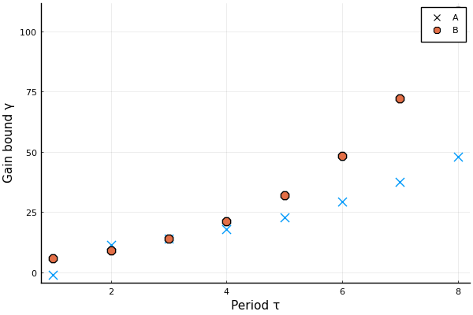

# State-Feedback Delayed Integrator Example
We will study two instances of the first-order delayed integrator where the gain has unknown sign
```math
y_t = y_{t-1} + iu_{t-2} + v_{t-1},
```
where ``i = \pm 1``.
By storing the previous input signal, we can design state-feedback controllers.
Consider the two implementations
```math
\begin{aligned}
    x_{t+1} & = \underbrace{\begin{bmatrix}
        1 & i \\ 0 & 0
    \end{bmatrix}}_{A_i} x_t + \underbrace{\begin{bmatrix} 0 \\ 1 \end{bmatrix}}_{B} \\
    x_{t+1} & = \underbrace{\begin{bmatrix}
        1 & 1 \\ 0 & 0
    \end{bmatrix}}_{A} x_t + \underbrace{\begin{bmatrix} 0 \\ i \end{bmatrix}}_{B_i}
\end{aligned}

```
We will refer to these models as ``A_i`` and ``B_i`` respectively.
In the ``B_i`` model, the sign of  the gain is revealed immediately upon applying the control signal, while in ``A_i`` the uncertainty is revealed through the delayed effect on the first state.
We will proceed to design minimax adaptive controllers with periodic switching for these two systems, and compare the gain bounds.

## Prerequisites

Load the following packages
```julia ss
using MinimaxAdaptiveControl
using LinearAlgebra
using JuMP
using Plots
using Clarabel # Optimization solver
```
We are using [Clarabel.jl](https://github.com/oxfordcontrol/Clarabel.jl), but any SDP solver [JuMP.jl](https://github.com/jump-dev/JuMP.jl) will do. 
See the following [list](https://jump.dev/JuMP.jl/stable/packages/solvers/).

We define an auxillary function to pass the `optimizer_factory` to JuMP's `Model` constructor. 
Just substitute this with whatever solver you want to use.
```julia ss
optimizer_factory=() -> Hypatia.Optimizer
```

## State-feedback models
We will define ``A_i`` and ``B_i`` as vectors, eaching containing two [SSLinMod](@ref) objects.
```julia 
# Define Ai system
A1 = [1. 1; 0 0]
A2 = [1. -1; 0 0]
B0 = [0 1.]'
Q = [1.0 0; 0 1.0]
R = fill(1.0,1,1)
sys1 = SSLinMod(A1, B0, Q, R)
sys2 = SSLinMod(A2, B0, Q, R)
syssAi = [sys1, sys2]

# Define Bi system
A0 = [1. 1; 0 0]
B0 = [0 1.]'
sys3 = SSLinMod(A0, B0, Q, R)
sys4 = SSLinMod(A0, -B0, Q, R)
syssBi = [sys3, sys4]
```

## Bisection
The procedure for synthesizing controllers depends on a candidate ``\ell_2``-gain level ``\gamma``.
In order to find the smallest ``\gamma``, we will use bisection.
We construct this bisection in two parts.
The function `attemptMACLMIs(syss, γ, T)` takes a vector of systems, performs the reduction with [reduceSys](@ref) and attempts to solve the periodic bellman inequality LMIs with period `T` using [MACLMIs](@ref).

```julia 
function attemptMACLMIs(syss, γ, T)
    N = length(syss)
    models = [Model(optimizer_factory()) for i = 1:N]
    set_silent.(models)
    (A, B, G, Ks, Hs) = reduceSys(syss, γ, models)
    model = Model(optimizer_factory())
    set_silent(model)
    Ps0, Psplus= MACLMIs(A, B, G, Ks, Hs, T, model)
    return termination_status(model)
end
```

Next, we implement a bisection algorithm to find the smallest ``\gamma`` for which we can solve the LMIs.
!!! warn "Numerics"
    Some solvers can run into numerical issues when ``\gamma`` or the period becomes large.

```julia
function bisect(syss, fun, T; gammamin = 1.0, gammamax = 500.0, tol = 1e-3)
    γmin = gammamin
    γmax = gammamax
    if fun(syss, gammamax, T) != MOI.OPTIMAL
        error("gammamax is not feasible")
    end
    while γmax - γmin > tol
        γ = (γmin + γmax) / 2
        if fun(syss, γ, T) == MOI.OPTIMAL
            γmax = γ
        else
            γmin = γ
        end
    end
    return γmax
end
```

## Results

We run the bisection algorithm for the two systems with periods from ``1`` to ``8``, setting ``\gamma = -1`` if the optimization problem is infeasible.
```julia
Tmax = 8
gammamins = zeros(Tmax, 2)
for t = 1:Tmax
    try
        gammamins[t, 1] = bisect(syssAi, attemptMACLMIs, t)
    catch
        gammamins[t, 1] = -1
    end
    try
        gammamins[t, 2] = bisect(syssBi, attemptMACLMIs, t)
    catch
        gammamins[t, 2] = -1
    end
end
```
The resulting gain-bounds are

| Period | ``\gamma_{A_i}`` | ``\gamma_{B_i}`` |
|-----|------|------|
|  1  | -1   | 5.8  |
|  2  | 11.2 | 9.2  |
|  3  | 13.9 | 14.0 |
|  4  | 17.8 | 21.3 |
|  5  | 22.7 | 32.0 |
|  6  | 29.2 | 48.1 |
|  7  | 37.4 | 72.3 |
|  8  | 48.0 | 108.5|


We can plot them nicely using e.g. [PyPlot](https://github.com/JuliaPy/PyPlot.jl).
```julia
pyplot()
plot(
     gammamins, 
     seriestype=:scatter, 
     marker=[:x :o], 
     markersize = 8,
    label = ["A" "B"],
    xlabel = "Period τ",
    ylabel = "Gain bound γ"
   )
```

