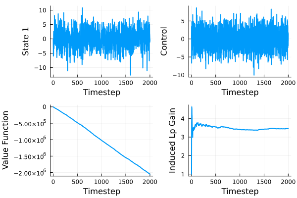

# State Feedback: Double Intergrator with Unknown Sign 
This recreates the controller from A. Rantzer, “Minimax adaptive control for a finite set of linear systems,” in Proc. 3th Annu. Learning Dyn. Control Conf., vol. 144, Jun. 07 – 08 2021, pp. 893–904. 
See the [arXiv version](https://arxiv.org/abs/2011.10814).

We consider a discrete-time double integrator with unknown input direction
```math
    \begin{aligned}
        x_{t+1} & = \begin{bmatrix}
            2 & -1 & -1 \\
            1 & 0 & 0 \\
            0 & 0 & 0 
        \end{bmatrix} + 
        x_t \pm
        \begin{bmatrix}
            0 \\ 0 \\ 1
        \end{bmatrix}
            u_t + 
            I w_t
    \end{aligned}
```

## Preamble
We load the packages
```julia
using MinimaxAdaptiveControl 
using LinearAlgebra
using JuMP
using Plots
using Clarabel # Open source SDP solver
```

We use [Clarabel](https://github.com/oxfordcontrol/Clarabel.jl) here, but any [JuMP](https://github.com/jump-dev/JuMP.jl) compatible SDP solver will do.

Switch this out with whatever optimizer you are using
```julia
optimizer_factory = () -> Clarabel.Optimizer
```

## System definition
We define the system matrices, and the cost function
```math
    \sum_{t = 0}^\infty \left( |x_t|^2_Q + |u_t|^2_R - \gamma^2 |w_t|^2 \right),
```
where ``Q = I`` and ``R = I``.

```julia
A0 = [
    2.0 -1.0 1.0;
    1.0 0.0 0.0;
    0.0 0.0 0.0
   ]
B0 = [0.0; 0.0; 1.0;;]
Q = Matrix(1.0I, 3, 3)
R = Matrix(1.0I, 1, 1)
γ = 19.0
sys1 = SSLinMod(A0, B0, Q, R)
sys2 = SSLinMod(A0, -B0, Q, R)
sys = [sys1, sys2]
```

## Reduction to principal problem
We reduce the uncertain system `sys` to principal model form using [reduceSys](@ref)
```julia
models = [Model(optimizer_factory()), Model(optimizer_factory())]
(A, B, G, Ks, Hs) = reduceSys(sys, γ, models)
```
Here we get the matrices
```math
A = 0, \quad B = 0, \quad G = I
```
The feedback gains are
```math
\begin{aligned}
K_1 & = \begin{bmatrix} 1.8 & -1.3 & 1.3 \end{bmatrix} \\
K_2&  = \begin{bmatrix} -1.8 & 1.3 & -1.3 \end{bmatrix}
\end{aligned}
```
The cost matrices become
```math
H_1 = \begin{bmatrix}
    -1804.0 &  722.0 & -722.0 &  0.0 & 722.0 & 361.0  &  0.0\\
    722.0   & -360.0 & 361.0  &  0.0 & -361.0 &  0.0  &  0.0\\
    -722.0  & 361.0  & -360.0 &  0.0 & 361.0 &   0.0  &  0.0\\
    0.0     &  0.0   &  0.0   & -360.0 &  0.0 &   0.0 & 361.0\\
    722.0   & -361.0 & 361.0  &  0.0 & -361.0 &   0.0 &  0.0\\
    361.0   &  0.0   &  0.0   &  0.0 &  0.0 & -361.0 &  0.0\\
    0.0     &  0.0   &  0.0   & 361.0 &  0.0 &   0.0 & -361.0
\end{bmatrix}
```
and
```math
H_2 = \begin{bmatrix}
    -1804.0 &  722.0 & -722.0 &  0.0 & 722.0 & 361.0  &  0.0\\
    722.0   & -360.0 & 361.0  &  0.0 & -361.0 &  0.0  &  0.0\\
    -722.0  & 361.0  & -360.0 &  0.0 & 361.0 &   0.0  &  0.0\\
    0.0     &  0.0   &  0.0   & -360.0 &  0.0 &   0.0 & -361.0\\
    722.0   & -361.0 & 361.0  &  0.0 & -361.0 &   0.0 &  0.0\\
    361.0   &  0.0   &  0.0   &  0.0 &  0.0 & -361.0 &  0.0\\
    0.0     &  0.0   &  0.0   & -361.0 &  0.0 &   0.0 & -361.0
    \end{bmatrix}
```

They differ only in the elemets on the (4, 7)th and (7, 4)th elements.

## Controller synthesis 
We first ensure that the associated performance level and feedback gains solves the Bellman inequalities using [MACLMIs](@ref)
```julia
model = Model(optimizer_factory())
period = 1
Ps0, Psplus= MACLMIs(A, B, G, Ks, Hs, period, model)
```
and verify the termination status of the optimization routine
```
julia>
termination_status(model)
OPTIMAL::TerminationStatusCode = 1
```

Next we construct the selection rule and controller objects using [getPeriodicSelectionRule](@ref) and [MAController](@ref):
```julia
selectionRule = getPeriodicSelectionRule(period)
N = length(Hs)
mac = MAController(zeros(3), A, B, G, Ks, Hs, zeros(N), selectionRule)
```

## Simulation
We first set up the matrices holding the states, outputs, control signal and disturbances
```julia
Tdur = 2000
states = zeros(Tdur + 1, 3)
outputs = zeros(Tdur + 1, 3)
controls = zeros(Tdur, 1)
processDisturbances = randn(Tdur, 3)
measurementDisturbances = zeros(Tdur, 3)
```

We also want to track the time-evolution of the value-function and the empirical ``\ell_2``-gain using [getValueFunction](@ref) and [InducedlpGain](@ref)
```julia
vfun = getValueFunction(mac, Ps0, N)
dc= InducedlpGain(0.0, 0.0, 0.0, 2)
metrics = [vfun, dc]
metricResults = zeros(Tdur + 1, length(metrics))
```

Next we construct the [SSPlant](@ref) for data generation and [simulate!](@ref)
```julia
plant = SSPlant(A0, -B0, zeros(3))
simulate!(states, outputs, controls, processDisturbances, measurementDisturbances, metricResults, metrics, plant, mac, Tdur)
```
and plot the results
```julia
plot(
     [states[1:Tdur, 1] controls[1:Tdur] metricResults[1:Tdur, :]], layout = (2, 2),
     xlabel = "Timestep",
     ylabel = ["State 1" "Control" "Value Function" "Induced Lp Gain"],
     legend = false,
     linewidth = 2
    )
```

